# Aplicativo Web - Quintal da Amora

**Linha de Projeto:**  
Web App  

**Autor:**  
Francisco Marcelo Caetano Costa  

**Data da Proposta:**  
12/04/2026  

**Versão:**  
1.0  

---

## 1. Visão do Produto e Impacto

### 1.1 Contexto e Problema

O projeto Quintal da Amora consiste no desenvolvimento de uma plataforma SaaS (Software as a Service) voltada para gerenciamento, organização e experiência digital de eventos presenciais.

A empresa interessada no desenvolvimento da plataforma é a Amora Book Store, responsável pela organização do evento Quintal da Amora, realizado na cidade de Joinville - SC.

A solução foi idealizada para auxiliar tanto os organizadores quanto os visitantes do evento, centralizando informações, automatizando processos e proporcionando uma experiência mais moderna, organizada e interativa durante a realização das atividades no evento.

Eventos presenciais como o Quintal da Amora, enfrentam desafios significativos relacionados a organização, comunicação e gestão de conteúdos durante sua realização. Esses problemas afetam diretamente tanto os organizadores do evento quanto os visitantes que dependem de informações claras e processos estruturados para participar das atividades.

O problema ocorre durante a realização do evento, onde há grande circulação de pessoas e múltiplas atividades acontecendo ao mesmo tempo como concursos, programação cultural e funcionamento da praça de alimentação.

Atualmente o Quintal da Amora utiliza processos manuais ou ferramentas não integradas, como redes sociais e grupos de comunicação como WhatsApp. Dessa forma resulta em diversas dificuldades para os organizadores e clientes, como:

- Ausência de dados precisos em relação a frequência de participantes.  
- Atrasos na disseminação de informações e cronogramas de atividades.    
- Baixa visibilidade dos produtos oferecidos pelos vendedores.  

---

### 1.2 Origem da Demanda e Evidências

#### Demanda Externa

O projeto tem como base o evento comunitário Quintal da Amora realizado em Joinville, voltado para a comunidade geek e otaku da região.

O evento está na sua 15ª edição e vem apresentando crescimento contínuo no número de participantes a cada nova realização. Com um público frequente e cada vez mais conectado, surgem desafios relacionados a organização e ao gerenciamento das atividades que ocorrem durante o evento.

Atualmente diversas funcionalidades importantes como controle de presença, acompanhamento da programação e participação em concursos não estão integradas em uma única plataforma, sendo realizadas de forma manual ou espalhadas em outras ferramentas.

Diante desse contexto, é evidente a necessidade de uma solução que faça a integração dessas atividades promovendo um maior controle, automatização dos processos e melhoria na organização geral do evento tanto para os organizadores quanto para os visitantes.

---

#### Pesquisas com Usuários

Foi realizada uma pesquisa com 22 pessoas, com o objetivo de entender melhor a experiência dos usuários no Quintal da Amora e identificar as principais dificuldades enfrentadas.

Em relação ao perfil dos usuários observou-se que a maioria é composta por visitantes mais de 70%, seguido por expositores (22,7%) e uma menor parcela de organizadores o que mostra uma visão ampla dos diferentes públicos envolvidos no evento.

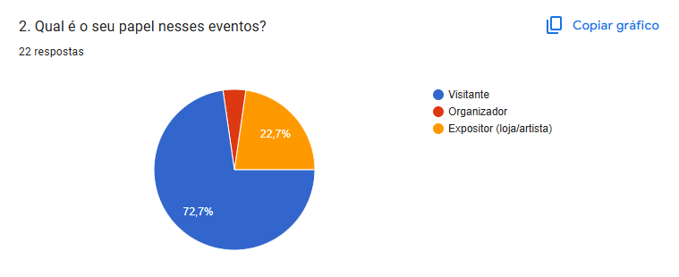

Quando perguntados sobre as dificuldades enfrentadas os principais problemas identificados foram:

- Falta de avisos em tempo real (54,5%)  
- Dificuldade em conhecer todas as atrações (50%)  
- Falta de informação sobre horários (45,5%)  
- Dificuldade em realizar pedidos (40,9%)  
- Desorganização em concursos (36,4%)  

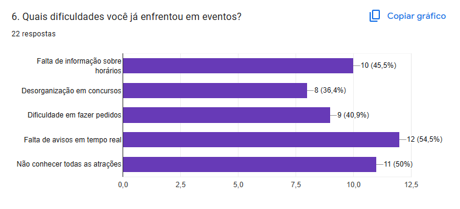

Os dados demonstram que a maior parte das dificuldades está na comunicação e organização das atividades durante o evento, evidenciando a ausência de uma estrutura centralizada para gestão dessas informações.

---

#### Evidências de Interesse

A organizadora do evento Quintal da Amora, Amanda Belato Leal Nunes, manifestou formalmente interesse na proposta de desenvolvimento da solução, destacando a necessidade de melhorias na gestão do evento devido ao crescimento contínuo do público.

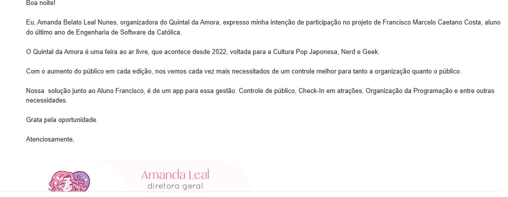
---

### 1.3 Análise de Soluções Existentes (Benchmark)

#### Sympla  
Link: https://www.sympla.com.br  

O Sympla é uma plataforma para a criação, divulgação e venda de ingressos para eventos. Seu público-alvo inclui organizadores de eventos de diferentes tamanhos desde pequenos encontros até grandes eventos corporativos.

Suas principais funcionalidades envolvem o gerenciamento de inscrições, controle de participantes e emissão de ingressos digitais. No entanto, a plataforma demonstra limitações em contextos quando aplicada a eventos comunitários como o Quintal da Amora pois seu foco principal está na venda de ingressos e não na gestão operacional do evento em tempo real.

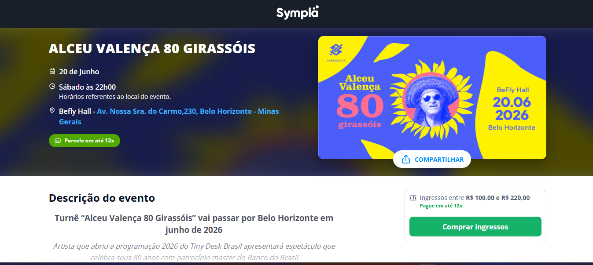
---

#### Eventbrite  
Link: https://www.eventbrite.com  

O Eventbrite é uma plataforma voltada para a organização e divulgação de eventos com foco em um público maior e eventos de médio a grande porte.

Entre seus recursos estão o gerenciamento de inscrições, controle de público e divulgação de eventos. Apesar de ser completo em alguns sentidos apresenta limitações parecidas ao Sympla, pois não atende de forma eficiente eventos locais além de não oferecer suporte para operações internas como pedidos em praça de alimentação ou gerenciamento de atividades simultâneas.

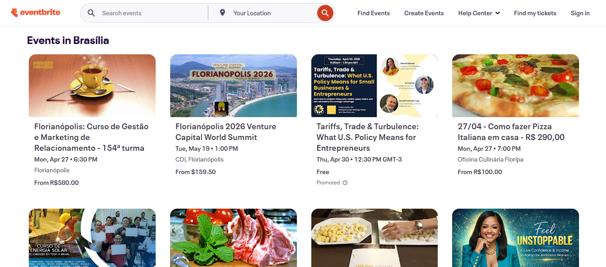
---

#### Redes sociais (Instagram e WhatsApp)

Atualmente, muitos eventos utilizam redes sociais como Instagram e aplicativos de mensagens como WhatsApp para divulgar informações e se comunicar com o público. Essas ferramentas têm como principal vantagem a facilidade de uso e ampla adoção pelos usuários.

No entanto, apresentam limitações como a falta de centralização das informações, dificuldade de controle e organização dos dados e ausência de automação. Informações importantes podem se perder facilmente e nem todos os participantes recebem os avisos em tempo suficiente.

---

#### Planilhas e métodos manuais

Outra solução comum é o uso de planilhas ou anotações para controle de participantes e organização geral do evento. Essas ferramentas são simples e de baixo custo sendo utilizadas principalmente por organizadores.

Entretanto, esse método apresenta limitações como maior probabilidade de erros e dificuldade de atualização em tempo real. Além disso, não permite integração com o público, reduzindo a sua eficiência de comunicação e de gestão do evento.

---

### Comparação

| Solução | Pontos Fortes | Limitações |
|--------|--------------|-----------|
| Sympla | Plataforma consolidada, fácil criação de eventos, controle de ingressos | Foco em venda de ingressos, não possui gestão operacional interna |
| Eventbrite | Interface intuitiva, boa divulgação de eventos, alcance global | Voltado para eventos grandes e pagos |
| Aplicativos genéricos | Exibição de programação e notificações | Não possuem funcionalidades específicas |
| Redes sociais | Fácil comunicação e ampla adoção | Falta de centralização e controle |
| Planilhas | Simples de usar e sem custo | Alto risco de erro e baixa eficiência |

---

### Diferencial do Projeto

A criação de uma nova solução é justificada pela ausência de plataformas que atendam às necessidades operacionais de eventos presenciais. As soluções existentes analisadas focam na divulgação de eventos e na venda de ingressos, não focando na gestão em tempo real das atividades internas.

Observa-se uma lacuna no suporte a funcionalidades como controle de presença, gerenciamento de concursos, organização de pedidos para retirada e comunicação dinâmica com os participantes durante o evento.

Dessa forma, o projeto busca atender o nicho de eventos comunitários presenciais como o Quintal da Amora, oferecendo uma plataforma centralizada que integre gestão operacional, comunicação em tempo real e engajamento do público.

---

### 1.4 Público-Alvo

**Visitantes**
- participantes do evento  
- interessados na programação e atividades  
- usuários com nível técnico básico  

**Organizadores**
- responsáveis pela gestão do evento  
- controle de atividades e participantes  
- usuários com nível técnico básico a intermediário  

---

### 1.5 Objetivos do Projeto

**Objetivo Geral**  
Desenvolver uma plataforma web que auxilie na gestão e melhore o engajamento  de participantes de eventos presenciais, tendo como empresa interessada a Amora Book Store, responsável pela organização do evento Quintal da Amora

**Objetivos Específicos**
- Implementar sistema de check-in por QR Code  
- Desenvolver visualização da programação  
- Criar sistema de notificações em tempo real    
- Desenvolver gerenciamento de concursos  
- Criar painel administrativo  

---

### 1.6 Métricas de Sucesso (KPIs)

- Tempo de resposta das requisições inferior a 2 segundos  
- Suporte a pelo menos 1000 usuários simultâneos durante o evento  
- Redução de pelo menos 30% no número de atrasos  
- Alcançar pelo menos 70% de adesão dos participantes  
- Taxa mínima de 60% de visualização das notificações

## 2. Engenharia de Requisitos

### 2.1 Personas

#### Persona 1: O Participante

**Nome:** Lucas, 22 anos  

**Contexto:**  
É fã da cultura geek e otaku. Frequenta presencialmente todas as edições do Quintal da Amora.

**Objetivos:**  
Deseja acompanhar o cronograma de atividades de forma mais fácil e rápida. Também quer se informar para participar da gestão de concursos do evento.

**Principais Dificuldades:**  
Costuma perder tempo ao acessar as redes sociais do evento para procurar publicações do cronograma. Fica frustrado com a falta de avisos em tempo real para quem não está próximo ao local da atividade.

---

#### Persona 2: A Organizadora

**Nome:** Amanda, 30 anos  

**Contexto:**  
É responsável pela Amora Book Store e pela organização, operação e gestão do evento.

**Objetivos:**  
Precisa informar em tempo real ao público quais atividades irão acontecer, sem depender exclusivamente das redes sociais e chamadas presenciais. Busca maior controle do evento, mais dados para análises e uma melhor experiência para os participantes.

**Principais Dificuldades:**  
Sente que o uso de WhatsApp e planilhas se tornou menos eficiente e busca uma forma de otimizar esses processos. Tem dificuldades na gestão em tempo real devido ao crescimento contínuo do público.

---

#### Persona 3: O Expositor Local

**Nome:** Anselmo, 33 anos  

**Contexto:**  
É um expositor que possui um estande no evento.

**Objetivos:**  
Deseja focar nas vendas e utilizar o sistema web para visualizar melhor os seus dados durante o evento.

**Principais Dificuldades:**  
Perde muito tempo com processos manuais e sente falta de uma ferramenta focada na operação durante o evento.

---

### 2.2 Casos de Uso Principais

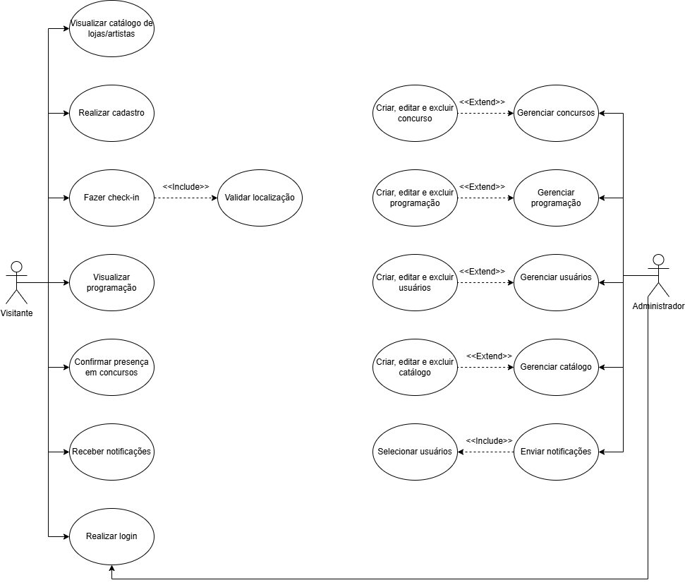

---

### 2.3 Requisitos Funcionais (RF)

#### Usuários e Acesso

- **RF01** – O sistema deve permitir o cadastro de usuários  
- **RF02** – O sistema deve permitir login e logout  
- **RF03** – O sistema deve diferenciar perfis de usuários (visitante e administrador)  

#### Check-in no Evento

- **RF04** – O sistema deve permitir check-in por QR Code  
- **RF05** – O sistema deve registrar o horário de entrada do usuário  

#### Programação do Evento

- **RF06** – O sistema deve exibir a programação completa do evento  
- **RF07** – O sistema deve permitir que administradores cadastrem e editem programações  

#### Concursos e Atividades

- **RF08** – O sistema deve permitir confirmação de presença em concursos  
- **RF09** – O sistema deve notificar usuários inscritos sobre horários das atividades  
- **RF10** – O sistema deve gerenciar lista de participantes  

#### Notificações

- **RF11** – O sistema deve enviar notificações sobre eventos e atividades  
- **RF12** – O sistema deve enviar alertas de chamada para concursos  

#### Catálogo de Lojas e Artistas

- **RF13** – O sistema deve listar lojas e artistas participantes  
- **RF14** – O sistema deve exibir detalhes de cada participante  
- **RF15** – O sistema deve permitir cadastro e edição pelo administrador  

#### Administração

- **RF16** – O sistema deve possuir painel administrativo  
- **RF17** – O sistema deve permitir gerenciamento de usuários  
- **RF18** – O sistema deve permitir gerenciamento do evento, incluindo programação e concursos  

---

### 2.4 Requisitos Não Funcionais (RNF)

#### Desempenho

- **RNF01** – O sistema deve responder requisições em até 2 segundos  
- **RNF02** – O sistema deve suportar múltiplos usuários simultâneos durante o evento  

#### Usabilidade

- **RNF03** – A interface deve ser responsiva para dispositivos móveis  
- **RNF04** – O sistema deve ser de fácil uso para usuários leigos  

#### Segurança

- **RNF05** – O sistema deve garantir autenticação segura (JWT ou sessão)  
- **RNF06** – O sistema deve proteger os dados dos usuários  
- **RNF07** – O sistema deve restringir acesso ao painel administrativo  

#### Disponibilidade

- **RNF08** – O sistema deve estar disponível durante todo o evento  
- **RNF09** – O sistema deve funcionar em navegadores modernos  

#### Escalabilidade

- **RNF10** – O sistema deve suportar aumento de usuários sem perda significativa de performance  

#### Manutenibilidade

- **RNF11** – O sistema deve possuir código organizado e documentado  

---

### 2.5 Regras de Negócio

#### Validação de Presença

O sistema deverá possuir uma funcionalidade de check-in para registrar a presença dos participantes. Essas informações serão utilizadas na geração de relatórios do evento.

#### Permissões de Disparo

O envio de notificações em tempo real será obrigatório no sistema. Apenas usuários com perfil de administrador poderão enviar esses avisos.

#### Sincronização de Concursos

A abertura e o fechamento das inscrições de concursos deverão respeitar as validações do cronograma oficial do evento.

#### Restrição de Visibilidade e Edição do Cronograma

O cronograma de atividades terá visibilidade pública para consulta. Entretanto, alterações, atrasos e cancelamentos de atrações só poderão ser realizados por usuários com nível de permissão de administrador.

---

### 2.6 Fora do Escopo

#### Comercialização de Ingressos

O sistema não atuará como plataforma de venda de ingressos ou inscrições pagas antecipadas, pois o evento Quintal da Amora é gratuito.

#### Rede Social Integrada

O aplicativo web será focado na operação e gestão do evento. Portanto, não contará com recursos de interação social direta entre usuários, como chat privado, lista de amigos ou feed de postagens.

#### Gateway de Pagamento Complexo

O processamento e liquidação financeira de vendas dos expositores não será gerenciado pelo aplicativo, sendo realizado apenas presencialmente.

---

# 3. Fluxos e Comportamento do Sistema

## 3.1 Fluxo Principal do Usuário

### Diagrama de Atividades

#### Visão dos Usuários

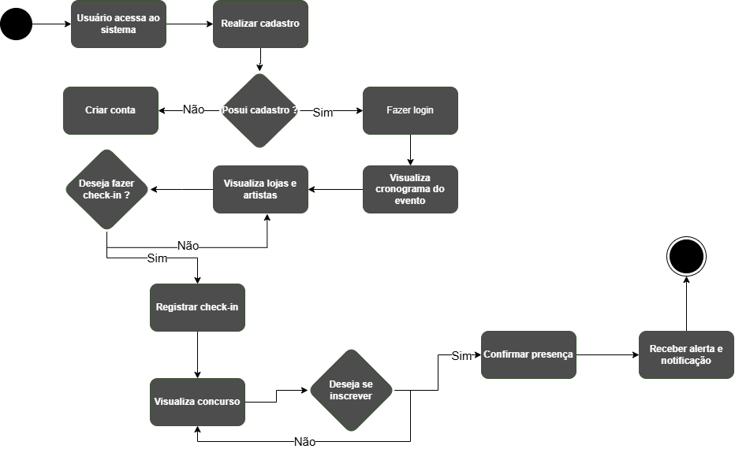

#### Visão dos Administradores

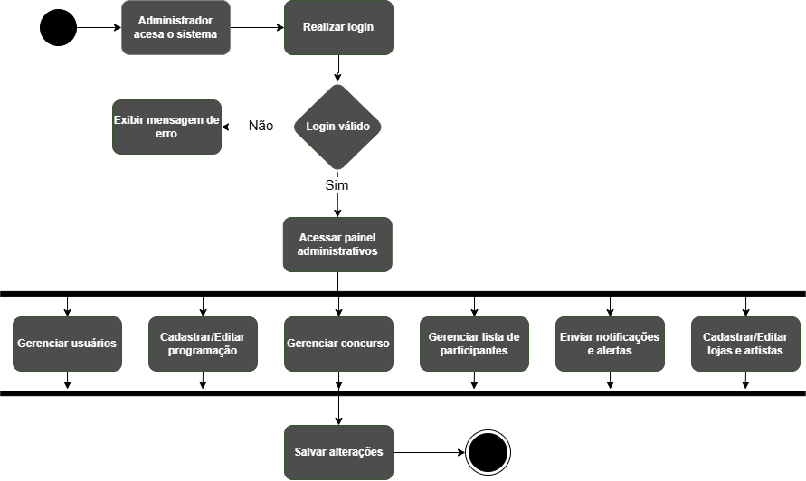

---

### Diagrama de Sequência

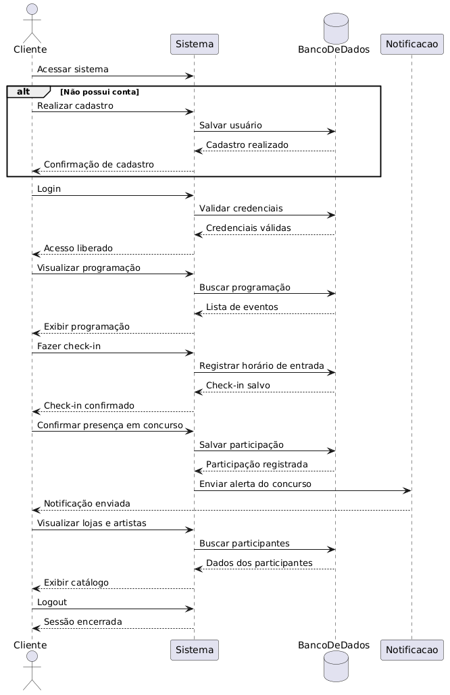

---

## 3.2 Fluxos Alternativos

### Exceção 1: Limite de Vagas em Concursos

**Cenário:**  
Um participante tenta se inscrever em um concurso, porém a atividade já atingiu o limite máximo de vagas estipulado pela organização.

**Comportamento do Sistema:**  
O botão “Inscrever-se” será desabilitado no frontend. Caso a requisição ainda seja enviada ao servidor, o backend rejeitará a inscrição, exibirá a mensagem “Vagas Esgotadas” e atualizará o status no cronograma para os demais usuários.

---

### Exceção 2: Tentativa de Acesso Não Autorizado à Gestão

**Cenário:**  
Um usuário comum tenta acessar rotas administrativas por meio de manipulação de URL.

**Comportamento do Sistema:**  
O backend validará a falta de permissão do usuário, bloqueará a requisição retornando erro `403 Forbidden` e redirecionará o usuário para a tela inicial do cronograma.

---

### Exceção 3: Encerramento do Evento e Bloqueio de Interações

**Cenário:**  
O horário oficial do evento é encerrado, porém usuários ainda tentam executar ações como envio de notificações ou realização de check-ins.

**Comportamento do Sistema:**  
O sistema identificará o encerramento do evento com base no cronograma oficial e desabilitará todas as ações interativas, mantendo apenas a visualização pública das informações.

---

### Exceção 4: Atraso na Resposta do Servidor sob Carga Máxima

**Cenário:**  
Ocorrem picos de acesso no momento em que o sistema dispara notificações gerais, causando lentidão no processamento.

**Comportamento do Sistema:**  
O frontend exibirá um indicador de carregamento (“Enviando...”), evitando múltiplos cliques. Caso o servidor demore para responder, será exibida a mensagem “Processando notificações”.

---

# 4. Mockups e Experiência do Usuário (UX)

## 4.1 Fluxo de Navegação

O fluxo de navegação do sistema representa o caminho percorrido pelos usuários durante a utilização da plataforma, demonstrando como ocorre a navegação entre as principais telas e funcionalidades do aplicativo web.

O fluxo é focado nos participantes do evento que desejam acessar funcionalidades como programação, concursos, check-in e catálogo de lojas e artistas.

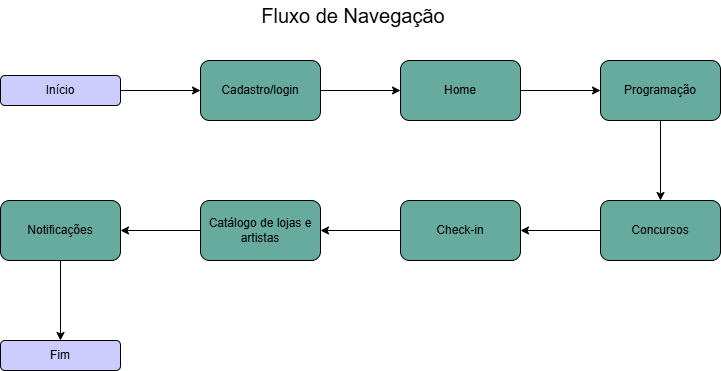

## 4.2 Wireframes ou Mockups das Telas

Os protótipos foram desenvolvidos seguindo uma identidade visual do evento Quintal da Amora, inspirada na cultura geek e otaku.

### Tela Inicial

A tela inicial foi desenvolvida para apresentar rapidamente as principais informações do evento, permitindo que o usuário visualize a programação, lojas participantes, avisos importantes e acesso às principais funcionalidades do sistema.

#### Principais Funcionalidades

- Visualização da programação do evento
- Acesso às lojas e artistas participantes
- Visualização de avisos importantes
- Navegação entre páginas do sistema
- Acesso ao login e cadastro

#### Principais Ações do Usuário

- Navegar pelas funcionalidades do sistema
- Visualizar horários das atrações
- Consultar informações do evento
- Acessar concursos e atividades
- Realizar login ou cadastro

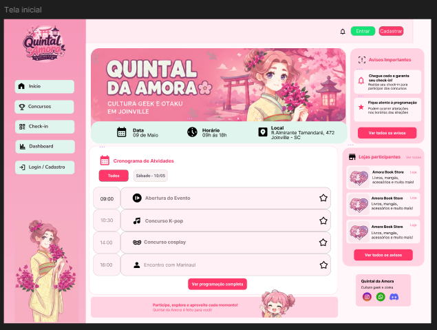

### Fluxo principal

### Tela Inicial

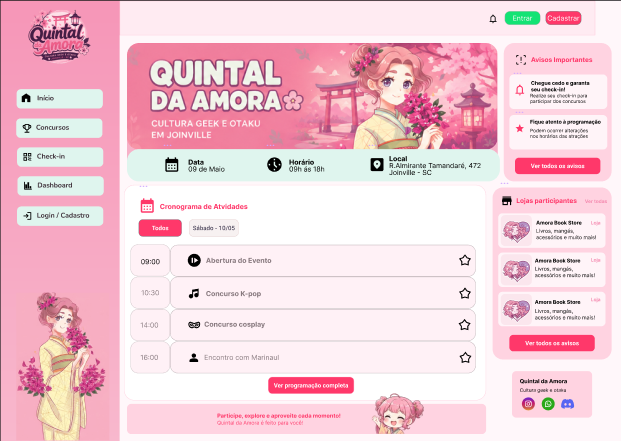

### Tela de Login/Cadastro

A tela de login permite que usuários autenticados acessem funcionalidades da plataforma, como inscrições, check-in e personalização da experiência no evento.

#### Principais Funcionalidades

- Autenticação de usuários
- Cadastro de nova conta
- Recuperação de senha
- Login rápido e intuitivo

#### Principais Ações do Usuário

- Inserir e-mail e senha
- Criar conta
- Recuperar senha
- Acessar o sistema

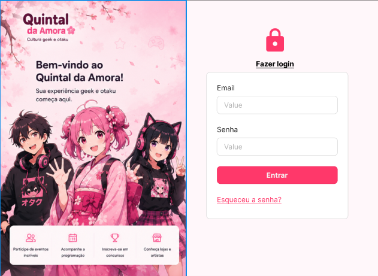

### Tela de Programação do Evento

A tela de programação permite que o visitante acompanhe todas as atividades do evento organizadas por dia e horário.

#### Principais Funcionalidades

- Exibição completa do cronograma
- Filtro por dias do evento
- Organização por horário

#### Principais Ações do Usuário

- Consultar horários
- Visualizar detalhes das atrações
- Filtrar data
- Organizar planejamento de visita

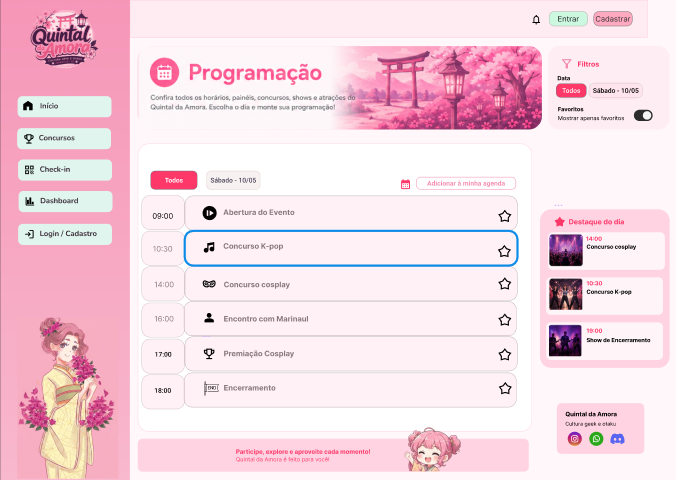

### Tela de Concursos

A tela de concursos foi desenvolvida para apresentar os concursos disponíveis durante o evento.

#### Principais Funcionalidades

- Exibição dos concursos disponíveis
- Visualização das regras
- Informações sobre horários
- Inscrição em concursos

#### Principais Ações do Usuário

- Visualizar concursos
- Realizar inscrição
- Acompanhar horários

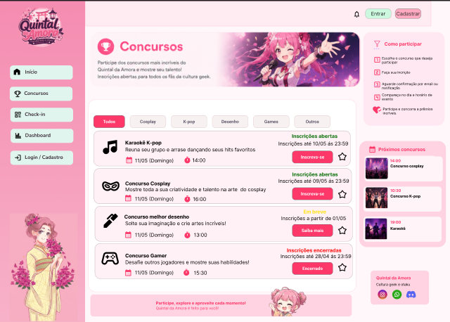

### Tela de Check-in

A tela de check-in foi desenvolvida para facilitar a confirmação de presença do visitante no evento.

#### Principais Funcionalidades

- Realização de check-in digital
- Confirmação de participação
- Geração de QR Code
- Exibição do status do check-in

#### Principais Ações do Usuário

- Confirmar presença no evento
- Visualizar QR Code
- Consultar status da entrada
- Receber confirmação de acesso

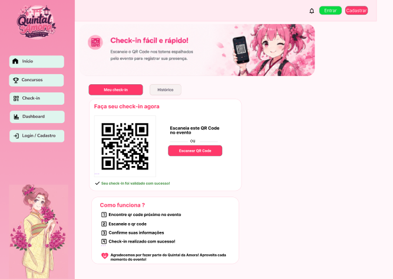

## 4.3 Fluxo de Interação do Usuário

### Passo 1 — Acesso ao Sistema

O usuário acessa a plataforma Quintal da Amora através da tela inicial do sistema.

- programação do evento
- concursos
- lojas participantes
- informações gerais

### Passo 2 — Login ou Cadastro

Para acessar funcionalidades personalizadas, o usuário realiza login ou cria uma nova conta.

- e-mail
- senha
- confirmação de cadastro

### Passo 3 — Visualização da Programação

Após acessar o sistema, o usuário pode consultar a programação completa do evento.

- visualizar horários
- consultar atrações
- acompanhar atividades por dia

### Passo 4 — Participação em Concursos

O usuário pode acessar a área de concursos para consultar informações e realizar inscrições.

- visualizar categorias
- consultar regras
- realizar inscrição

### Passo 5 — Realização do Check-in

Ao chegar no evento, o visitante realiza o check-in digital utilizando a plataforma.

- presença no evento
- validação do ingresso
- acesso às atividades

## Protótipo Navegável

https://www.figma.com/design/ibf3uH0GvsxAJaFGBh6csL/Untitled?node-id=0-1&t=yFmr1o0aAHqEBozv-1

# 5. Arquitetura do Sistema

## 5.1 Diagrama C4

O modelo C4 foi utilizado para representar a arquitetura do sistema em diferentes níveis de detalhes, permitindo o entendimento desde a visão geral da aplicação até a organização interna dos componentes responsáveis pelas funcionalidades do sistema.

---

### Nível 1 – Diagrama de Contexto

O Diagrama de Contexto apresenta uma visão macro da plataforma Quintal da Amora, demonstrando como o sistema interage com usuários e serviços externos.

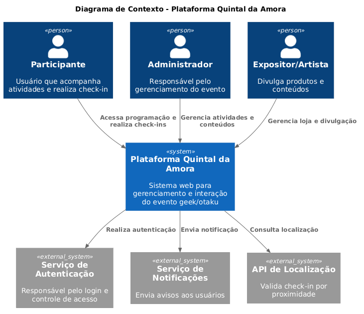

---

### Nível 2 – Diagrama de Containers

O Diagrama de Containers apresenta os principais blocos tecnológicos que compõem a aplicação.

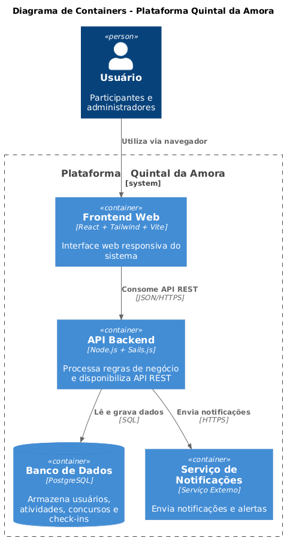

---

### Nível 3 – Diagrama de Componentes

O Diagrama de Componentes representa a organização interna do container da API Backend.

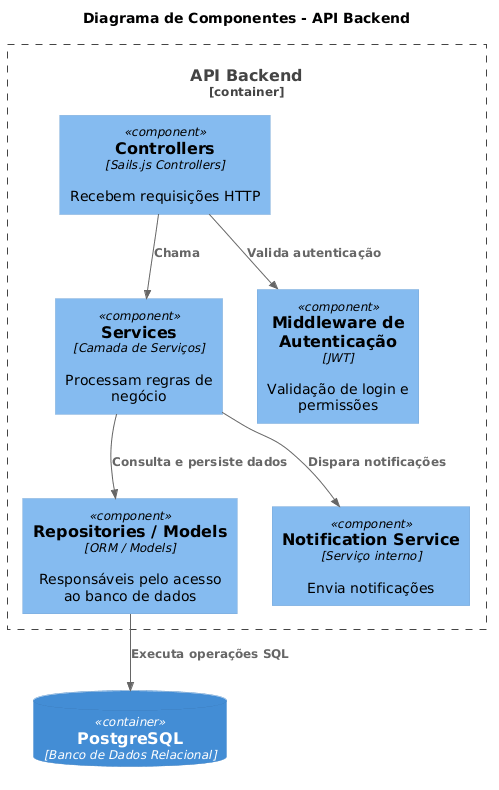

---

## 5.2 Modelo de Dados

O modelo de dados do sistema foi desenvolvido para armazenar informações relacionadas ao evento, usuários e funcionalidades da plataforma.

---

### DER – Diagrama Entidade Relacionamento

---

### Esquema Relacional

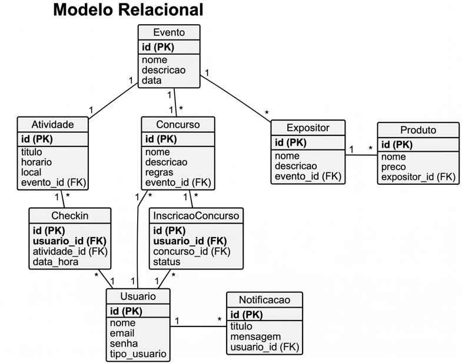

---

### Modelo de Documentos (NoSQL)

O sistema também poderá utilizar armazenamento NoSQL para notificações e logs em tempo real.

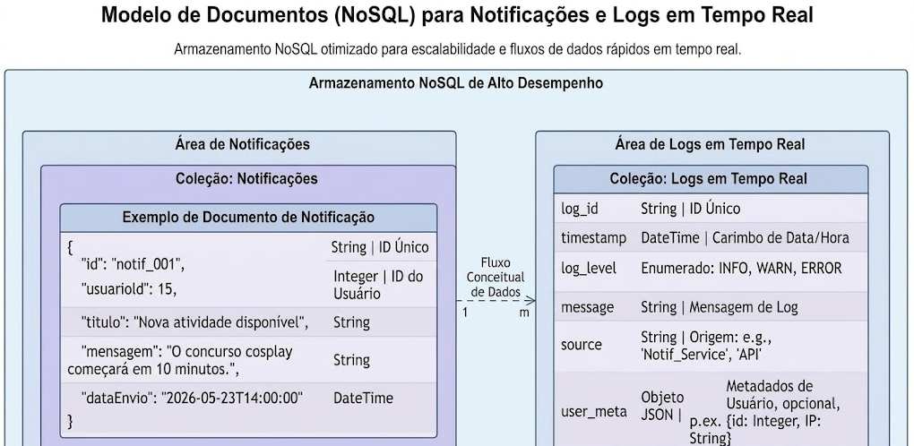

---

## 5.3 Principais Componentes

### API Backend

Responsável pelo processamento das regras de negócio e comunicação com o banco de dados.

---

### Sistema de Autenticação

Responsável pelo login, controle de sessão e permissões dos usuários.

---

### Módulo de Programação

Gerencia atividades, horários e informações do evento.

---

### Módulo de Concursos

Responsável pelo gerenciamento de concursos e confirmações de participação.

---

### Sistema de Check-in

Permite validar a presença dos participantes utilizando QR Code.

---

### Serviço de Notificações

Responsável pelo envio de avisos e atualizações em tempo real.

---

### Camada de Persistência

Responsável pelo armazenamento e recuperação das informações do sistema.

---

## 5.4 Stack Tecnológica

### React

Utilizado no frontend para criação de interfaces modernas, proporcionando melhor experiência ao usuário.

---

### Tailwind CSS

Escolhido para agilizar a estilização da aplicação e facilitar a criação de layouts responsivos.

---

### Vite

Utilizado como ferramenta de build por oferecer inicialização rápida e melhor desempenho durante o desenvolvimento.

---

### Node.js

Escolhido pela capacidade de lidar com múltiplas requisições simultâneas utilizando arquitetura assíncrona.

---

### Sails.js

Framework utilizado no backend para facilitar a construção da API REST e organização da aplicação.

---

### PostgreSQL

Banco de dados relacional escolhido pela confiabilidade, desempenho e suporte a relacionamentos complexos.

---

### JWT (JSON Web Token)

Utilizado para autenticação segura dos usuários e controle de acesso.

---

### Git e GitHub

Utilizados para versionamento de código e gerenciamento do projeto.

---

### Figma

Utilizado para prototipação das telas e desenvolvimento da interface visual do sistema.
