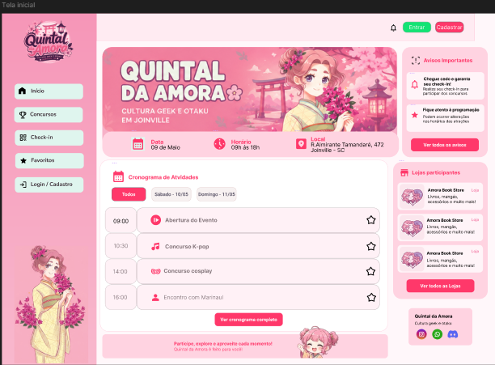
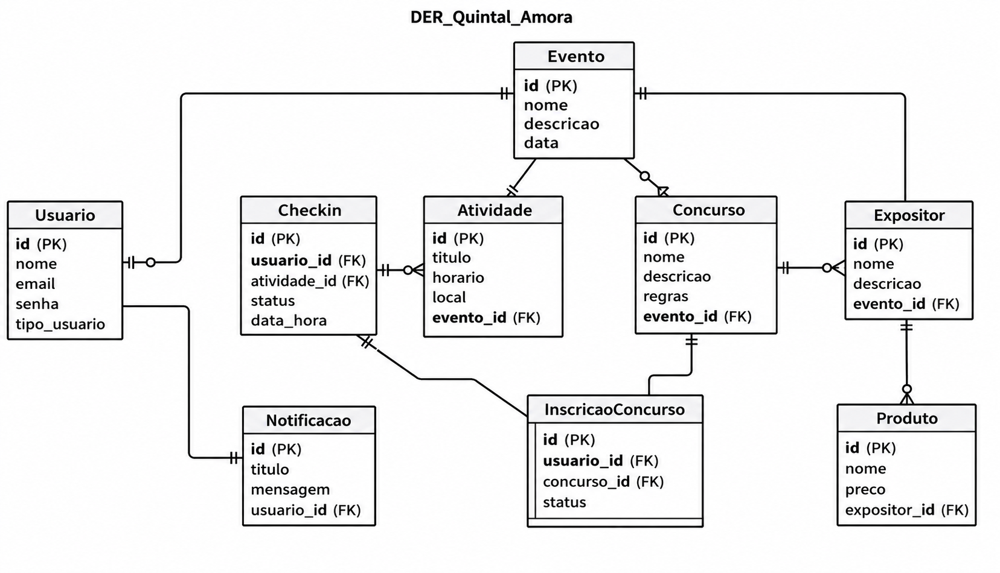

# Quintal da Amora Platform

**Linha de Projeto:**  
Web App  

**Autor:**  
Francisco Marcelo Caetano Costa  

**Data da Proposta:**  
12/04/2026  

**Versão:**  
3.0  

---

## 1. Visão do Produto e Impacto

### 1.1 Contexto e Problema

O projeto Quintal da Amora consiste no desenvolvimento de uma plataforma SaaS (Software as a Service) voltada para gerenciamento, organização e experiência digital de eventos presenciais. A empresa interessada no desenvolvimento da plataforma é a Amora Book Store, responsável pela organização do evento Quintal da Amora, realizado na cidade de Joinville - SC.

A solução foi idealizada para auxiliar tanto os organizadores quanto os visitantes do evento, centralizando informações, automatizando processos e proporcionando uma experiência mais moderna, organizada e interativa durante a realização das atividades no evento.

O principal problema identificado no evento Quintal da Amora está relacionado à comunicação e ao gerenciamento das informações durante sua realização. Como o evento reúne grande quantidade de participantes e diversas atividades simultâneas, como concursos, encontros com influenciadores, apresentações e atrações temáticas, torna-se necessário garantir que as informações estejam disponíveis de forma rápida, organizada e acessível. 

Atualmente o Quintal da Amora utiliza processos manuais ou ferramentas não integradas, como redes sociais e grupos de comunicação como WhatsApp, para divulgar informações e realizar parte da gestão operacional do evento. Esse cenário pode gerar dificuldades tanto para os organizadores quanto para os participantes, tais como: 

- Dificuldade em centralizar e atualizar informações sobre a programação do evento;
- Atrasos na comunicação de alterações de programação e avisos importantes;
- Falta de controle eficiente sobre inscrições e confirmações de participação em concursos;
- Ausência de dados consolidados sobre presença e participação dos visitantes;
- Aumento da demanda por atendimento manual para esclarecimento de dúvidas durante o evento.

Dessa forma, a proposta do sistema é centralizar comunicação, o gerenciamento da programação, o controle de concursos, controle de dados e o processo de check-in em uma única plataforma digital, proporcionando uma experiência mais organizada para participantes e organizadores.

---

### 1.2 Origem da Demanda e Evidências

#### Demanda Externa

O projeto tem como base o evento comunitário Quintal da Amora realizado em Joinville, voltado para a comunidade geek e otaku da região.

O evento está na sua 15ª edição e vem apresentando crescimento contínuo no número de participantes a cada nova realização. Com um público frequente e cada vez mais conectado, surgem desafios relacionados a organização e ao gerenciamento das atividades que ocorrem durante o evento.

Atualmente diversas funcionalidades importantes como controle de presença, acompanhamento da programação e participação em concursos não estão integradas em uma única plataforma, sendo realizadas de forma manual ou espalhadas em outras ferramentas.

Diante desse contexto, é evidente a necessidade de uma solução que faça a integração dessas atividades promovendo um maior controle, automatização dos processos e melhoria na organização geral do evento tanto para os organizadores quanto para os visitantes.

---

#### Pesquisas com Usuários

Foi realizada uma pesquisa com 22 pessoas, com o objetivo de entender melhor a experiência dos usuários no Quintal da Amora e identificar as principais dificuldades enfrentadas.

Em relação ao perfil dos usuários observou-se que a maioria é composta por visitantes mais de 70%, seguido por expositores (22,7%) e uma menor parcela de organizadores o que mostra uma visão ampla dos diferentes públicos envolvidos no evento.

Quando perguntados sobre as dificuldades enfrentadas os principais problemas identificados foram:

- Falta de avisos em tempo real (54,5%)  
- Dificuldade em conhecer todas as atrações (50%)  
- Falta de informação sobre horários (45,5%)  
- Dificuldade em realizar pedidos (40,9%)  
- Desorganização em concursos (36,4%)  

Os dados demonstram que a maior parte das dificuldades está na comunicação e organização das atividades durante o evento, evidenciando a ausência de uma estrutura centralizada para gestão dessas informações.

---

#### Evidências de Interesse

A organizadora do evento Quintal da Amora, Amanda Belato Leal Nunes, manifestou formalmente interesse na proposta de desenvolvimento da solução, destacando a necessidade de melhorias na gestão do evento devido ao crescimento contínuo do público.

---

### 1.3 Análise de Soluções Existentes (Benchmark)

#### Sympla  
Link: https://www.sympla.com.br  

O Sympla é uma plataforma para a criação, divulgação e venda de ingressos para eventos. Seu público-alvo inclui organizadores de eventos de diferentes tamanhos desde pequenos encontros até grandes eventos corporativos.

Suas principais funcionalidades envolvem o gerenciamento de inscrições, controle de participantes e emissão de ingressos digitais. No entanto, a plataforma demonstra limitações em contextos quando aplicada a eventos comunitários como o Quintal da Amora pois seu foco principal está na venda de ingressos e não na gestão operacional do evento em tempo real.

---

#### Eventbrite  
Link: https://www.eventbrite.com  

O Eventbrite é uma plataforma voltada para a organização e divulgação de eventos com foco em um público maior e eventos de médio a grande porte.

Entre seus recursos estão o gerenciamento de inscrições, controle de público e divulgação de eventos. Apesar de ser completo em alguns sentidos apresenta limitações parecidas ao Sympla, pois não atende de forma eficiente eventos locais além de não oferecer suporte para operações internas como pedidos em praça de alimentação ou gerenciamento de atividades simultâneas.

---

#### Redes sociais (Instagram e WhatsApp)

Atualmente, muitos eventos utilizam redes sociais como Instagram e aplicativos de mensagens como WhatsApp para divulgar informações e se comunicar com o público. Essas ferramentas têm como principal vantagem a facilidade de uso e ampla adoção pelos usuários.

No entanto, apresentam limitações como a falta de centralização das informações, dificuldade de controle e organização dos dados e ausência de automação. Informações importantes podem se perder facilmente e nem todos os participantes recebem os avisos em tempo suficiente.

---

#### Planilhas e métodos manuais

Outra solução comum é o uso de planilhas ou anotações para controle de participantes e organização geral do evento. Essas ferramentas são simples e de baixo custo sendo utilizadas principalmente por organizadores.

Entretanto, esse método apresenta limitações como maior probabilidade de erros e dificuldade de atualização em tempo real. Além disso, não permite integração com o público, reduzindo a sua eficiência de comunicação e de gestão do evento.

---

### Comparação

| Solução | Pontos Fortes | Limitações |
|--------|--------------|-----------|
| Sympla | Plataforma consolidada, fácil criação de eventos, controle de ingressos | Foco em venda de ingressos, não possui gestão operacional interna |
| Eventbrite | Interface intuitiva, boa divulgação de eventos, alcance global | Voltado para eventos grandes e pagos |
| Aplicativos genéricos | Exibição de programação e notificações | Não possuem funcionalidades específicas |
| Redes sociais | Fácil comunicação e ampla adoção | Falta de centralização e controle |
| Planilhas | Simples de usar e sem custo | Alto risco de erro e baixa eficiência |

---

### Diferencial do Projeto

A criação de uma nova solução é justificada pela ausência de plataformas que atendam às necessidades operacionais de eventos presenciais. As soluções existentes analisadas focam na divulgação de eventos e na venda de ingressos, não focando na gestão em tempo real das atividades internas.

Observa-se uma lacuna no suporte a funcionalidades como controle de presença, gerenciamento de concursos e comunicação dinâmica com os participantes durante o evento. Essas limitações mostram que as ferramentas atuais não foram projetadas para lidar com a complexidade e a dinâmica de eventos.

Dessa forma, o projeto busca atender o nicho de eventos comunitários presenciais como o Quintal da Amora, oferecendo uma plataforma centralizada que integre gestão operacional, comunicação em tempo real e engajamento do público.

---

### 1.4 Público-Alvo

O sistema é destinado a dois perfis principais:

**Visitantes**
- participantes do evento  
- interessados na programação e atividades  
- usuários com nível técnico básico  

**Organizadores**
- responsáveis pela gestão do evento  
- controle de atividades e participantes  
- usuários com nível técnico básico a intermediário  

---

### 1.5 Objetivos do Projeto

**Objetivo Geral**  
Desenvolver uma plataforma web que auxilie na gestão e melhore o engajamento  de participantes de eventos presenciais, tendo como empresa interessada a Amora Book Store, responsável pela organização do evento Quintal da Amora.

**Objetivos Específicos**
- Implementar sistema de check-in por QR Code: Desenvolver uma funcionalidade que permita o registro da entrada dos participantes no evento por meio da leitura de um QR Code disponibilizado na entrada e em pontos estratégicos do evento.
- Desenvolver visualização da programação: Disponibilizar uma área para consulta da programação completa do evento, contendo informações sobre horários, atividades, concursos e atrações.
- Criar sistema de notificações em tempo real: Permitir o envio de comunicados, avisos e atualizações instantâneas aos participantes durante a realização do evento.
- Desenvolver gerenciamento de concursos: Implementar funcionalidades para cadastro e gerenciamento dos concursos realizados durante o evento, permitindo definir informações como nome, categoria, descrição, data, horário, limite de participantes e período de inscrição. Os participantes poderão realizar inscrições e confirmar presença diretamente pela plataforma.
- Criar painel administrativo: Desenvolver uma interface destinada aos organizadores para gerenciamento de usuários, programação, concursos, notificações e demais informações do evento.

---

### 1.6 Métricas de Sucesso (KPIs)

- Tempo médio de resposta das requisições inferior a 2 segundos.
- Suporte mínimo de 700 usuários simultâneos durante os períodos de maior utilização do evento, considerando a média de público das edições anteriores e a projeção de crescimento do evento.
- Redução mínima de 30% no número de atrasos em atividades programadas.
- Alcançar ao mínimo 70% de adesão dos participantes utilizando a plataforma durante o evento.
- Envio de notificações com taxa mínima de visualização de 60% pelos usuários.
- Disponibilidade (uptime) mínima de 99% durante o período de realização do evento.
- Taxa de erros inferior a 1% das requisições processadas pelo sistema.
- Taxa de sucesso no envio de notificações superior a 95%.
- Monitoramento contínuo de falhas de autenticação e tentativas de acesso não autorizado.

## 2. Engenharia de Requisitos

### 2.1 Personas

#### Persona 1: O Participante

**Nome:** Lucas, 22 anos  

**Contexto:**  
É fã da cultura geek e otaku. Frequenta presencialmente todas as edições do Quintal da Amora.

**Objetivos:**  
Deseja acompanhar o cronograma de atividades de forma mais fácil e rápida. Também quer se informar para participar da gestão de concursos do evento.

**Principais Dificuldades:**  
Costuma perder tempo ao acessar as redes sociais do evento para procurar publicações do cronograma. Fica frustrado com a falta de avisos em tempo real para quem não está próximo ao local da atividade.

---

#### Persona 2: A Organizadora

**Nome:** Amanda, 30 anos  

**Contexto:**  
É a responsável da Amora Book Store. Responsável por todo planejamento, operação e gestão durante o evento.

**Objetivos:**  
Precisa informar em tempo real para o público quais atividades irão acontecer, sem depender muito das redes sociais e com chamadas ao vivo. Busca ter um controle maior do evento, com mais dados para análises, e uma melhor experiência do cliente.

**Principais Dificuldades:**  
Sente que o uso de WhatsApp e planilhas se tornou menos eficiente e quer uma forma de otimizar todos esses processos. Tem dificuldade na gestão em tempo real devido ao aumento do público contínuo.

---

#### Persona 3: O Expositor Local

**Nome:** Anselmo, 33 anos  

**Contexto:**  
É um expositor que participa do evento Quintal da Amora para divulgar seus produtos e serviços ao público.

**Objetivos:**  
Deseja aumentar sua visibilidade durante o evento e facilitar que os participantes encontrem informações sobre seu estande, produtos e localização através da plataforma.

**Principais Dificuldades:**  
Possui pouca visibilidade para participantes que não conhecem previamente seu trabalho e depende da circulação do público pelo evento para divulgar seus produtos.

---

### 2.2 Casos de Uso Principais

Os principais casos de uso do sistema estão relacionados à navegação dos usuários pelo evento, gerenciamento de inscrições e controle de presença. A plataforma permitirá que visitantes consultem a programação disponível, realizem inscrições em concursos e atividades, acompanhem seus eventos favoritos e efetuem check-in por meio de QR Code. Além disso, administradores poderão cadastrar eventos, gerenciar participantes, acompanhar inscrições e visualizar relatórios de participação, garantindo a organização das atividades promovidas pelo Quintal da Amora.

Com base nesses casos de uso, foram definidos os requisitos funcionais apresentados a seguir.

---

### 2.3 Requisitos Funcionais (RF)

#### Usuários e Acesso

- **RF01** – O sistema deve permitir o cadastro de usuários  
- **RF02** – O sistema deve permitir login e logout  
- **RF03** – O sistema deve diferenciar perfis de usuários (visitante e administrador)  

#### Check-in no Evento

- **RF04** – O sistema deve permitir check-in por QR Code  
- **RF05** – O sistema deve registrar o horário de entrada do usuário  

#### Programação do Evento

- **RF06** – O sistema deve exibir a programação completa do evento  
- **RF07** – O sistema deve permitir que administradores cadastrem e editem programações  

#### Concursos e Atividades

- **RF08** – O sistema deve permitir confirmação de presença em concursos  
- **RF09** – O sistema deve notificar usuários inscritos sobre horários das atividades  
- **RF10** – O sistema deve gerenciar lista de participantes  

#### Notificações

- **RF11** – O sistema deve enviar notificações sobre eventos e atividades  
- **RF12** – O sistema deve enviar alertas de chamada para concursos  

#### Catálogo de Lojas e Artistas

- **RF13** – O sistema deve listar lojas e artistas participantes  
- **RF14** – O sistema deverá permitir que os participantes visualizem informações dos expositores cadastrados pela organização, incluindo nome e descrição   
- **RF15** – O sistema deve permitir cadastro e edição pelo administrador  

#### Administração

- **RF16** – O sistema deve possuir painel administrativo  
- **RF17** – O sistema deve permitir gerenciamento de usuários(adicionar/remover usuário)
- **RF18** – O sistema deve permitir gerenciamento do evento (programação, concursos, alertas, notificações)  

---

### 2.4 Requisitos Não Funcionais (RNF)

#### Desempenho

- **RNF01** – O sistema deve responder requisições em até 2 segundos  
- **RNF02** – O sistema deve suportar múltiplos usuários simultâneos durante o evento  

#### Usabilidade

- **RNF03** – A interface deve ser responsiva para dispositivos móveis  
- **RNF04** – O sistema deve ser de fácil uso para usuários leigos  

#### Segurança

- **RNF05** – O sistema deve garantir autenticação segura (JWT ou sessão)  
- **RNF06** – O sistema deve proteger os dados dos usuários  
- **RNF07** – O sistema deve restringir acesso ao painel administrativo  

#### Disponibilidade

- **RNF08** – O sistema deve estar disponível durante todo o evento    

#### Escalabilidade

- **RNF09** – O sistema deve suportar aumento de usuários sem perda significativa de performance  

#### Manutenibilidade

- **RNF10** – O sistema deve possuir código organizado e documentado  

---

### 2.5 Regras de Negócio

#### Validação de Presença

Deverá ter uma forma de check-in no sistema. Isso garante os dados necessários para a tela de relatórios

#### Sistema de check-in por QR Code:

Na tela de check-in permite aos participantes realizar seu próprio check-in através da leitura de QR Codes disponibilizados na entrada e em pontos estratégicos do evento.

#### Permissões de Disparo

O envio de notificações em tempo real será obrigatório no sistema. Apenas usuários “Administradores” poderão enviar esses avisos.

#### Sincronização de Concursos

A abertura e fechamento da gestão de concursos deverão respeitar as validações do cronograma oficial.

#### Restrição de Visibilidade e Edição do Cronograma

O cronograma de atividades, terá visibilidade pública para a visualização. No entanto, alterações, atrasos e cancelamentos de atrações só poderão ser executados por usuários com nível de permissão de "Administrador". 

---

### 2.6 Fora do Escopo

#### Comercialização de Ingressos

O sistema não atuará como plataforma de venda de ingressos ou inscrições pagas antecipadas, pois o evento Quintal da Amora é gratuito.

#### Rede Social Integrada

O aplicativo web focará na operação e gestão do evento. Portanto, não contará com recursos de interação social direta entre os usuários (como chat privado, lista de amigos ou feed de postagens).

#### Gateway de Pagamento Complexo

O processamento e liquidação financeira de vendas dos expositores não será gerenciado pelo aplicativo, sendo realizado apenas presencialmente.

## 2.7 Priorização dos Requisitos

A priorização dos requisitos foi realizada utilizando a técnica **MoSCoW**, que classifica as funcionalidades de acordo com sua importância para a entrega da solução.

### Must Have (Obrigatórios)

Funcionalidades essenciais para o funcionamento da plataforma:

- Cadastro e autenticação de usuários;
- Visualização da programação do evento;
- Inscrição e confirmação em concursos;
- Check-in por QR Code;
- Sistema de notificações;
- Painel administrativo.

### Should Have (Importantes)

Funcionalidades relevantes que agregam valor ao sistema, mas não impedem sua operação inicial:

- Catálogo de expositores;
- Favoritar atividades;
- Histórico de participação.

### Could Have (Desejáveis)

Funcionalidades que podem ser implementadas em versões futuras para melhorar a experiência dos usuários:

- Avaliação de atividades;
- Sistema de recomendações;
- Gamificação para participantes.

### Won't Have (Fora do Escopo Inicial)

Funcionalidades que não serão desenvolvidas na primeira versão do projeto:

- Marketplace;
- Venda online de produtos;
- Pagamentos digitais;
- Chat entre usuários.

---

# 3. Fluxos e Comportamento do Sistema

## 3.1 Fluxo Principal do Usuário

### Diagrama de Atividades

O diagrama de atividades apresentado a seguir descreve o fluxo principal de interação dos usuários com a plataforma Quintal da Amora, desde a consulta da programação até a realização do check-in nos eventos. 

#### Visão dos Usuários

#### Visão dos Administradores

---

### Diagrama de Sequência

O diagrama de sequência apresentado a seguir demonstra a comunicação entre usuário, interface e banco de dados durante os principais processos do sistema.

---

## 3.2 Fluxos Alternativos

### Exceção 1: Limite de Vagas em Concursos

**Cenário:**  
Um participante tenta se inscrever em um concurso, mas a atividade já atingiu o limite máximo de vagas estipulado pela organização.

**Comportamento do Sistema:**  
O botão de "Inscrever-se" é desabilitado no frontend. Caso a requisição chegue ao servidor, o backend rejeita a inscrição, exibe a mensagem "Vagas Esgotadas" e atualiza o status no cronograma para todos os demais usuários.

---

### Exceção 2: Tentativa de Acesso Não Autorizado à Gestão

**Cenário:**  
Um usuário comum (Participante) tenta acessar rotas de alteração do cronograma através de manipulação de URL.

**Comportamento do Sistema:**  
O backend válida a falta de credencial do usuário , bloqueia a requisição retornando um erro 403 Forbidden e redireciona o usuário imediatamente para a tela inicial do cronograma.

---

### Exceção 3: Encerramento do Evento e Bloqueio de Interações

**Cenário:**  
O horário oficial de funcionamento do Quintal da Amora é encerrado , mas usuários (organização ou participantes logados) tentam executar ações como enviar notificações em tempo real ou realizar novos check-ins.

**Comportamento do Sistema:**  
O sistema identifica o fim do evento com base no cronograma. Ele desabilita todos os botões de ação interativa e o aplicativo volta a ter visibilidade pública apenas para leitura.

---

### Exceção 4: Atraso na Resposta do Servidor sob Carga Máxima

**Cenário:**  
Ocorrem picos de acesso no momento exato em que o sistema dispara um aviso geral. O servidor pode levar mais que os 2 segundos estipulados para processar tudo.

**Comportamento do Sistema:**  
O front-end da organizadora exibe um indicador de carregamento ("Enviando...") em vez de permitir múltiplos cliques. Se o servidor demorar, ele não falha silenciosamente; retorna um aviso de "Processando notificações".

### Exceção 5: Instabilidade na Conexão da Internet

**Cenário:**  
Durante o uso do sistema pelo usuário a conexão da internet caí, impedindo a comunicação entre os dispositivos do usuário e o servidor da plataforma.

**Comportamento do Sistema:**
O aplicativo informa ao usuário que a conexão está indisponível e mantém acessíveis as informações previamente carregadas, como programação e dados já sincronizados. Funcionalidades que dependem de comunicação em tempo real, como envio de notificações, realização de check-ins e atualização de inscrições em concursos, permanecem temporariamente indisponíveis até o restabelecimento da conexão.

---

# 4. Mockups e Experiência do Usuário (UX)

## 4.1 Fluxo de Navegação

O fluxo de navegação do sistema representa o caminho percorrido pelos usuários durante a utilização da plataforma, demonstrando como ocorre o fluxo entre as principais telas e funcionalidades do aplicativo web.

O fluxo é focado nos usuários que participam do evento e desejam acessar funcionalidades como programação, concursos, check-in e catálogo de lojas e artistas.

## 4.2 Wireframes ou Mockups das Telas

Os protótipos foram desenvolvidos seguindo uma identidade visual do evento Quintal da Amora, inspirada na cultura geek e otaku.

### Tela Inicial

A tela inicial foi desenvolvida para apresentar rapidamente as principais informações do evento, permitindo que o usuário visualize a programação, lojas participantes, avisos importantes e acesso às principais funcionalidades do sistema.

#### Principais Funcionalidades

- Visualização da programação do evento
- Acesso às lojas e artistas participantes
- Visualização de avisos importantes
- Navegação entre páginas do sistema
- Acesso ao login e cadastro

#### Principais Ações do Usuário

- Navegar pelas funcionalidades do sistema
- Visualizar horários das atrações
- Consultar informações do evento
- Acessar concursos e atividades
- Realizar login ou cadastro

### Fluxo principal

### Tela Inicial

### Tela de Login/Cadastro

A tela de login permite que usuários autenticados acessem funcionalidades da plataforma, como inscrições, check-in e personalização da experiência no evento.

#### Principais Funcionalidades

- Autenticação de usuários
- Cadastro de nova conta
- Recuperação de senha
- Login rápido e intuitivo

#### Principais Ações do Usuário

- Inserir e-mail e senha
- Criar conta
- Recuperar senha
- Acessar o sistema

### Tela de Programação do Evento

A tela de programação permite que o visitante acompanhe todas as atividades do evento organizadas por dia e horário.

#### Principais Funcionalidades

- Exibição completa do cronograma
- Filtro por dias do evento
- Organização por horário

#### Principais Ações do Usuário

- Consultar horários
- Visualizar detalhes das atrações
- Filtrar data
- Organizar planejamento de visita

### Tela de Concursos

A tela de concursos foi desenvolvida para apresentar os concursos disponíveis durante o evento. A interface permite que os usuários acompanhem datas e inscrições dos concursos.

#### Principais Funcionalidades

- Exibição dos concursos disponíveis
- Informações sobre horários
- Inscrição em concursos

#### Principais Ações do Usuário

- Visualizar concursos
- Realizar inscrição
- Acompanhar horários

### Tela de Check-in

A tela de check-in foi desenvolvida para facilitar a confirmação de presença do visitante no evento.

#### Principais Funcionalidades

- Realização de check-in digital
- Confirmação de participação
- Geração de QR Code
- Exibição do status do check-in

#### Principais Ações do Usuário

- Confirmar presença no evento
- Visualizar QR Code
- Consultar status da entrada
- Receber confirmação de acesso

## 4.3 Fluxo de Interação do Usuário

### Passo 1 — Acesso ao Sistema

O usuário acessa a plataforma Quintal da Amora através da tela inicial do sistema.

- programação do evento
- concursos
- lojas participantes
- informações gerais

### Passo 2 — Login ou Cadastro

Para acessar funcionalidades personalizadas, o usuário realiza login ou cria uma nova conta.

- e-mail
- senha
- confirmação de cadastro

### Passo 3 — Visualização da Programação

Após acessar o sistema, o usuário pode consultar a programação completa do evento.

O visitante consegue:

- visualizar horários
- consultar atrações
- acompanhar atividades por dia

### Passo 4 — Participação em Concursos

O usuário pode acessar a área de concursos para consultar informações e realizar inscrições.

- visualizar categorias
- realizar inscrição

### Passo 5 — Realização do Check-in

Ao chegar no evento, o visitante realiza o check-in digital utilizando a plataforma.

- presença no evento
- validação do ingresso
- acesso às atividades

## Protótipo Navegável

https://www.figma.com/design/ibf3uH0GvsxAJaFGBh6csL/Untitled?node-id=0-1&t=yFmr1o0aAHqEBozv-1

# 5. Arquitetura do Sistema

## 5.1 Diagrama C4

O modelo C4 foi utilizado para representar a arquitetura do sistema em diferentes níveis de detalhes, permitindo o entendimento desde a visão geral da aplicação até a organização interna dos componentes responsáveis pelas funcionalidades do sistema.

---

### Nível 1 – Diagrama de Contexto

O Diagrama de Contexto apresenta uma visão macro da plataforma Quintal da Amora, demonstrando como o sistema interage com usuários e serviços externos.

---

### Nível 2 – Diagrama de Containers

O Diagrama de Containers apresenta os principais blocos tecnológicos que compõem a aplicação.

---

### Nível 3 – Diagrama de Componentes

O Diagrama de Componentes representa a organização interna do container da API Backend.

---

## 5.2 Modelo de Dados

O modelo de dados apresentado a seguir representa as entidades do sistema, seus atributos e relacionamentos necessários para o funcionamento da plataforma.

---

### DER – Diagrama Entidade Relacionamento

---

### Esquema Relacional

---

### Modelo de Documentos (NoSQL)

O sistema também poderá utilizar armazenamento NoSQL para notificações e logs em tempo real.

---

## 5.3 Principais Componentes

### API Backend

Responsável pelo processamento das regras de negócio e comunicação com o banco de dados.

---

### Sistema de Autenticação

Responsável pelo login, controle de sessão e permissões dos usuários.

---

### Módulo de Programação

Gerencia atividades, horários e informações do evento.

---

### Módulo de Concursos

Responsável pelo gerenciamento de concursos e confirmações de participação.

---

### Sistema de Check-in

Permite validar a presença dos participantes utilizando QR Code.

---

### Serviço de Notificações

Responsável pelo envio de avisos e atualizações em tempo real.

---

## 5.4 Stack Tecnológica

### React

Utilizado no frontend para criação de interfaces modernas, proporcionando melhor experiência ao usuário.

---

### Tailwind CSS

Escolhido para agilizar a estilização da aplicação e facilitar a criação de layouts responsivos.

---

### Vite

Utilizado como ferramenta de build por oferecer inicialização rápida e melhor desempenho durante o desenvolvimento.

---

### Node.js

Escolhido pela capacidade de lidar com múltiplas requisições simultâneas utilizando arquitetura assíncrona.

---

### Sails.js

Framework utilizado no backend para facilitar a construção da API REST e organização da aplicação.
---

### PostgreSQL

Banco de dados relacional escolhido pela confiabilidade, desempenho e suporte a relacionamentos complexos.

---

### JWT (JSON Web Token)

Utilizado para autenticação segura dos usuários e controle de acesso.

---

### Git e GitHub

Utilizados para versionamento de código e gerenciamento do projeto.

---

### Figma

Utilizado para prototipação das telas e desenvolvimento da interface visual do sistema.

## 5.5 Infraestrutura e Implantação

A plataforma **Quintal da Amora** será implantada em ambiente de nuvem, garantindo disponibilidade, escalabilidade e facilidade de manutenção. A arquitetura prevê a separação entre frontend, backend e banco de dados, permitindo a evolução independente de cada componente.

O frontend da aplicação poderá ser hospedado no **Netlify**, enquanto o backend será executado em serviços de nuvem utilizando o **Railway**. O banco de dados **PostgreSQL** será hospedado em ambiente gerenciado, garantindo maior confiabilidade, segurança e disponibilidade das informações armazenadas.

O processo de desenvolvimento seguirá práticas de **Integração Contínua e Entrega Contínua (CI/CD)**, utilizando o GitHub como plataforma de versionamento e o GitHub Actions para automatizar processos de validação, testes e implantação da aplicação.

Para monitoramento da plataforma serão utilizados logs de aplicação, métricas de utilização de recursos e indicadores de disponibilidade fornecidos pela infraestrutura de hospedagem, permitindo identificar falhas e acompanhar o desempenho do sistema.

Como estratégia de recuperação de desastres, serão realizados backups periódicos do banco de dados, possibilitando a restauração das informações em caso de falhas operacionais, perda de dados ou indisponibilidade temporária dos serviços.

---

# 6. Segurança e Privacidade

A segurança da informação é fundamental para garantir a confiabilidade da plataforma **Quintal da Amora**. O sistema será desenvolvido seguindo boas práticas de desenvolvimento seguro, visando proteger os dados dos usuários e garantir a integridade das informações armazenadas.

Entre as principais medidas adotadas estão:

- Proteção contra vulnerabilidades, incluindo validação de entradas, prevenção contra SQL Injection, Cross-Site Scripting (XSS) e falhas de autenticação;
- Implementação de autenticação segura por meio de login com e-mail e senha;
- Controle de autorização baseado em perfis de acesso, garantindo que cada usuário tenha acesso apenas às funcionalidades permitidas;
- Criptografia de senhas utilizando algoritmos de hash seguros, evitando o armazenamento de credenciais em texto puro;
- Utilização de conexões seguras por meio do protocolo HTTPS para proteção dos dados transmitidos entre cliente e servidor;
- Registro de logs de acesso e ações relevantes para auditoria e monitoramento do sistema.

### 6.1 Privacidade e LGPD

A plataforma está sendo desenvolvida com base nos princípios estabelecidos pela **Lei Geral de Proteção de Dados (LGPD - Lei nº 13.709/2018)**, garantindo transparência e segurança no tratamento dos dados pessoais.

Os dados coletados poderão incluir:

- Nome completo;
- Endereço de e-mail;
- Foto de perfil (opcional);
- Informações relacionadas à participação em concursos e atividades do evento;
- Histórico de check-ins realizados durante o evento.

Os dados serão armazenados em banco de dados seguro com acesso restrito aos administradores autorizados da organização do evento. As senhas serão armazenadas de forma criptografada, utilizando algoritmos de hash apropriados.

O usuário poderá solicitar a exclusão de sua conta e de seus dados pessoais através dos canais de contato disponibilizados pela organização do evento. Após a solicitação, os dados serão removidos ou anonimizados conforme as necessidades legais e operacionais do sistema.

---

# 7. Estratégia de Testes

A qualidade da plataforma **Quintal da Amora** será garantida por meio da aplicação de diferentes níveis de testes ao longo do desenvolvimento. Essa estratégia busca identificar falhas precocemente, validar requisitos funcionais e não funcionais e assegurar o funcionamento da aplicação em ambiente de produção.

### 7.1 Testes Unitários

Os testes unitários serão utilizados para validar individualmente funções, serviços e regras de negócio do sistema. Entre os cenários previstos estão a validação de autenticação de usuários, geração de QR Codes, gerenciamento de concursos e envio de notificações.

### 7.2 Testes de Integração

Os testes de integração terão como objetivo verificar a comunicação entre os componentes da aplicação, incluindo frontend, backend, banco de dados e serviços externos utilizados pelo sistema.

### 7.3 Testes End-to-End (E2E)

Os testes End-to-End irão simular a utilização real da plataforma pelos usuários, validando fluxos completos como cadastro, login, consulta da programação, inscrição em concursos, realização de check-in e recebimento de notificações.

### 7.4 Testes de Carga

Os testes de carga serão realizados para avaliar o comportamento da aplicação sob múltiplos acessos simultâneos, especialmente durante períodos de maior movimentação do evento. Esses testes permitirão identificar gargalos de desempenho e verificar a estabilidade da plataforma.

### 7.5 Testes de Segurança

Os testes de segurança serão utilizados para validar mecanismos de autenticação, autorização, proteção de rotas e validação de entradas de dados. Também serão realizadas verificações relacionadas às principais vulnerabilidades descritas pelo OWASP Top 10, contribuindo para a proteção das informações dos usuários.

---

# 8. Estimativa de Custos

A implantação da plataforma **Quintal da Amora** foi planejada considerando soluções adequadas ao porte do evento e ao estágio inicial do projeto.

| Componente | Solução Proposta | Custo Estimado |
|------------|------------------|----------------|
| Hospedagem Frontend | Vercel | Gratuito |
| Hospedagem Backend | Render | US$ 0 a US$ 25/mês |
| Banco de Dados PostgreSQL | PostgreSQL Gerenciado | Gratuito a US$ 20/mês |
| Domínio | Registro.br | Aproximadamente R$ 40 por ano |
| Notificações | Firebase Cloud Messaging | Gratuito |
| Repositório e CI/CD | GitHub e GitHub Actions | Gratuito |

O projeto utilizará inicialmente planos gratuitos ou de baixo custo oferecidos pelos provedores de hospedagem, permitindo a execução da aplicação sem investimentos significativos.

---

# 9. Planejamento do Projeto

| Marco | Descrição | Prazo |
|--------|------------|--------|
| M1 | Finalização do documento RFC com as assinaturas dos professores | Junho/2026 |
| M2 | Início do desenvolvimento do projeto | Julho/2026 |
| M3 | Desenvolvimento das funcionalidades principais (autenticação, programação e concursos) | Agosto/2026 |
| M4 | Desenvolvimento das funcionalidades complementares (check-in, notificações e expositores) | Setembro/2026 |
| M5 | Integração dos módulos e refinamento da interface do usuário | Outubro/2026 |
| M6 | Testes funcionais, correção de defeitos e validação com a empresa parceira | Novembro/2026 |
| M7 | Ajustes finais, documentação completa e preparação da apresentação | Novembro/2026 |
| M8 | Entrega da versão final do sistema e defesa do Trabalho de Conclusão de Curso | Dezembro/2026 |

---

# 10. Referências

- :contentReference[oaicite:0]{index=0}. Event Management and Ticketing Platform. Disponível em: https://www.eventbrite.com. Acesso em: 10 abr. 2026.
- :contentReference[oaicite:1]{index=1}. Plataforma de eventos, ingressos e gestão de participantes. Disponível em: https://www.sympla.com.br. Acesso em: 10 abr. 2026.
- :contentReference[oaicite:2]{index=2}. Disponível em: https://amorabookstore.com.br. Acesso em: 23 maio 2026.
- BRASIL. Lei nº 13.709, de 14 de agosto de 2018. Lei Geral de Proteção de Dados Pessoais (LGPD). Acesso em: 08 jun. 2026.

---

# 11. Apêndices

## 11.1 Mockups

### Central de Gerenciamento

A Central de Gerenciamento é a área administrativa da plataforma **Quintal da Amora**, utilizada pelos organizadores para gerenciar usuários, programação, concursos, notificações e demais informações do evento. Essa funcionalidade centraliza as operações administrativas, facilitando o controle e a atualização dos conteúdos disponibilizados aos participantes.

#### Principais funcionalidades

- Gerenciamento de usuários;
- Cadastro e edição da programação;
- Gerenciamento de concursos;
- Envio de notificações;
- Controle geral do evento.

#### Principais ações do usuário

- Criar e editar conteúdos;
- Gerenciar participantes;
- Acompanhar inscrições;
- Atualizar informações do evento;
- Enviar comunicados em tempo real.

## 11.2 Repositório do Projeto

Repositório contendo todas as informações do projeto:

**GitHub:** https://github.com/Franciscocosta10/quintal-amora-platform

## 11.3 Protótipo Navegável

O protótipo navegável do sistema pode ser acessado através do link:

**Figma:**  
https://www.figma.com/design/ibf3uH0GvsxAJaFGBh6csL/Untitled?node-id=0-1&t=yFmr1o0aAHqEBozv-1

O protótipo permite visualizar o fluxo de navegação e a disposição dos elementos da interface antes da implementação final.

---

# 12. Parecer do Comitê de Avaliação
